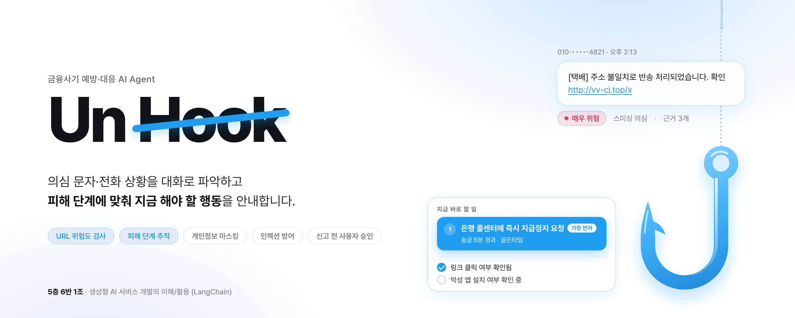
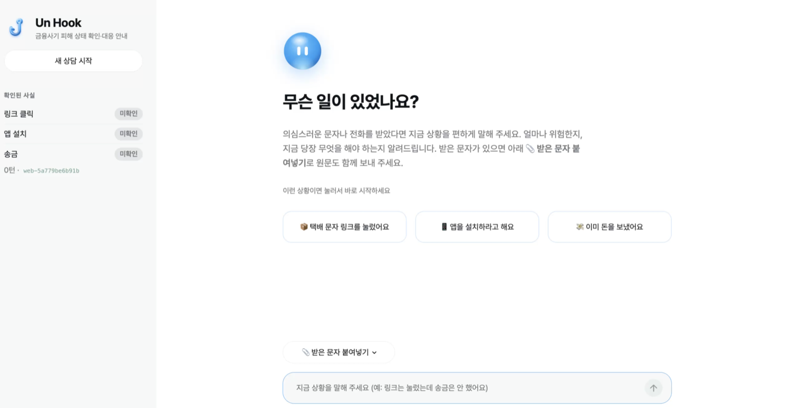
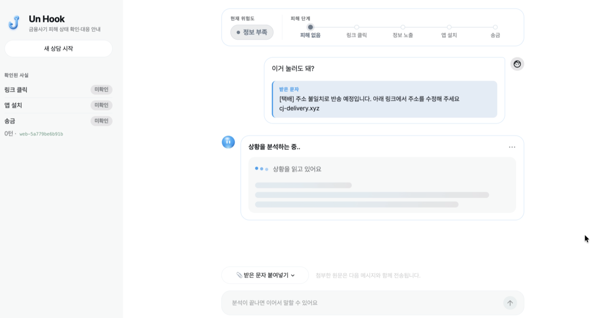
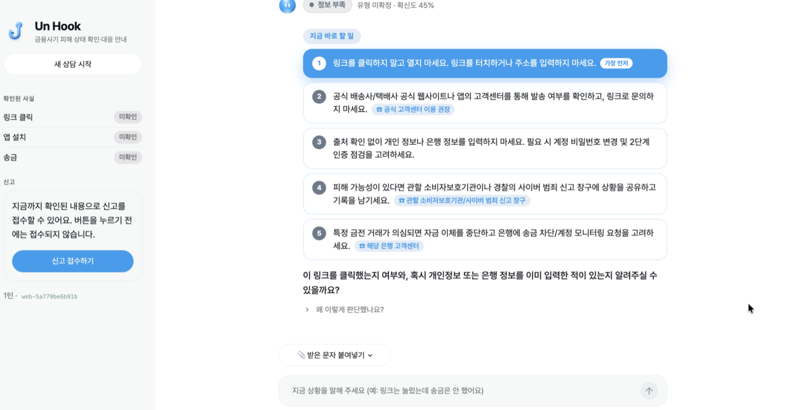
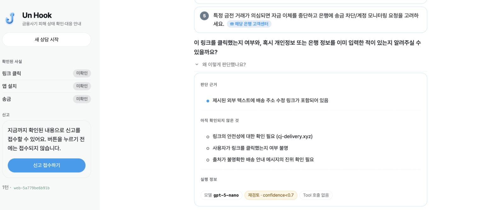
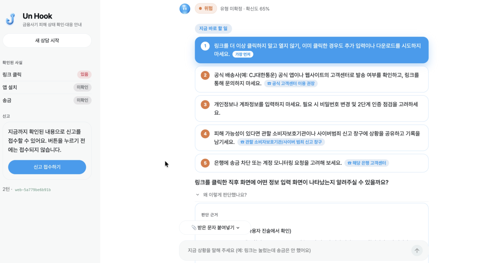
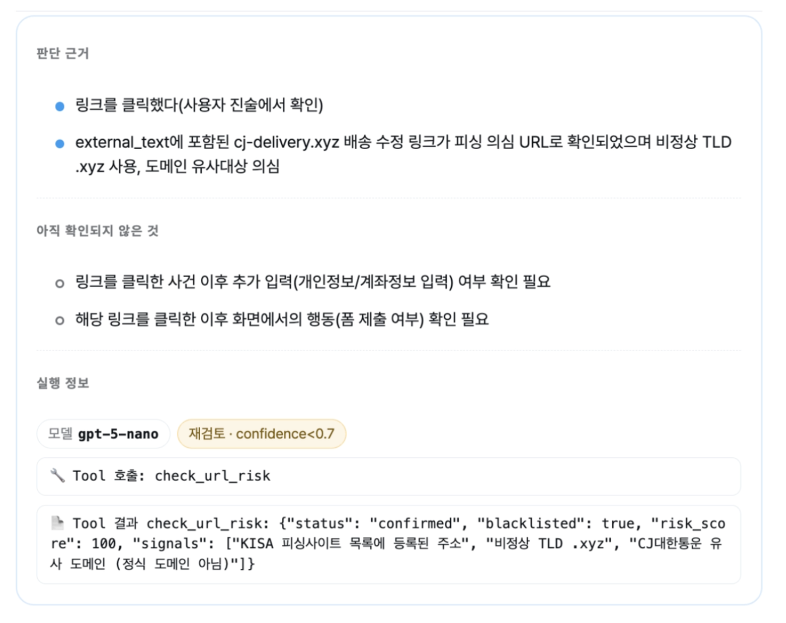
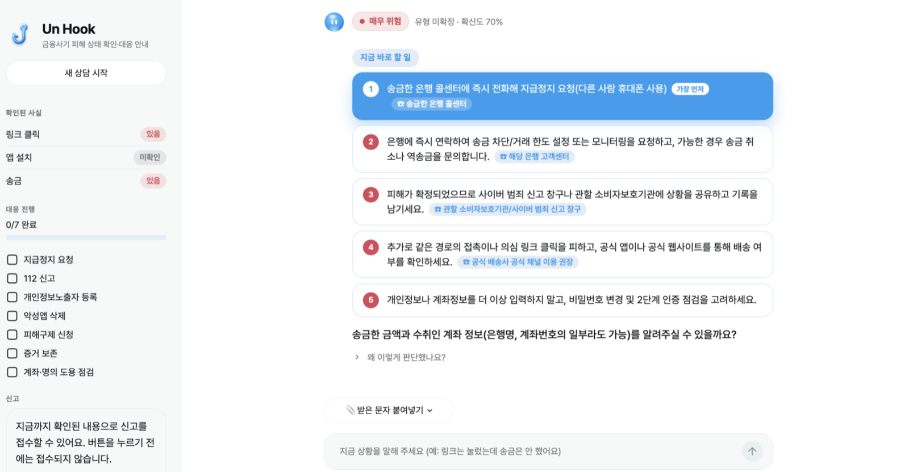

# Un Hook

보이스피싱·스미싱·메신저 피싱 등 금융사기 의심 상황을 대화로 파악하고, 피해 단계에 맞는 대응 행동을 안내하는 LangChain 기반 AI Agent.

## 문서

- [AI Agent 설계서](docs/agent-design.md) — 팀 공통 기술 명세. 모든 구현은 이 문서를 기준으로 한다.
- [구현 파일 및 공유 계약](docs/agent-design.md#5-구현-파일-및-공유-계약) — 파일별 작업 범위와 공통 코드 사용 규칙.
- [입력 보안 연결 안내](AGENTS.md#입력-보안-연결) — ③ 구현 API, 팀별 연결 작업 및 검증 방법.
- [Agent Core 안내](agent/README.md) — `build_unhook_agent()` 사용법, 모델 재검토 조건, 팀 모듈 연결 계약.
- 설계서 수정 제안 — [`report_to_authority` 접수번호](docs/proposal-report-receipt.md), [`URLRiskResult.status`](docs/proposal-url-risk-status.md).

## 공통 코드

`schemas.py`는 출력 스키마와 Tool 결과 타입, `state.py`는 State와 Runtime Context를 정의한다.
`config.py`는 설계서에 확정된 모델명과 승격 판단 기준을 제공한다.
작업 묶음 ①~⑥(Agent Core, Middleware, 입력 보안, 개인정보·출력 검증, Tool·메모리, RAG)과
시연 화면(`app.py`)까지 모두 구현되어 있다. 모델은 현재 `gpt-5-nano` 단일 모델이며,
`ESCALATION_MODEL`은 재검토 프로필(같은 모델, 더 긴 출력 한도)을 가리킨다.

```bash
python -m pip install -r requirements.txt
python -m unittest discover -s tests -v      # 공통 계약·보안·PII·Tool·RAG
python -m pip install pytest && python -m pytest -q agent/tests   # Agent Core
```

```python
from config import DEFAULT_MODEL, ESCALATION_MODEL, LOW_CONFIDENCE_THRESHOLD
from schemas import ScamAssessment
from state import RuntimeContext, UnHookState, create_initial_state
```

API 키 이름은 `.env.example`을 참고한다. 키는 실행 환경에 설정하며,
`.env`를 자동으로 읽지 않는다. 기본 보안 판별기는 의심 입력에서 OpenAI API를 호출하므로
실행 전에 환경변수를 설정한다. 테스트는 모의 모델을 사용해 키·네트워크 없이 실행한다.

## 시연 화면 실행

`app.py`는 Streamlit 기반 시연 화면이며 `agent/`의 전체 Agent(Tool·Middleware·마스킹 포함)에 연결된다.

```bash
python -m pip install -r requirements.txt
python -m pip install streamlit
export OPENAI_API_KEY="발급받은 키"
streamlit run app.py
```

- 브라우저에서 `내 상황 / 질문`과 `받은 문자·통화 원문`을 나눠 입력하고 **보내기**를 누른다.
- 응답은 위험도·사기 유형·피해 단계·지금 할 일·판단 근거·확인 필요·다음 질문으로 표시되며,
  **실행 정보**에서 사용 모델과 Tool 호출·결과를 확인할 수 있다.
- 사이드바에서 현재 피해 상태(링크 클릭·앱 설치·송금·체크리스트)를 확인하고 **새 대화 시작**으로 스레드를 초기화한다.
- 신고 접수는 **신고 접수 승인** 버튼을 누른 턴에서만 `report_to_authority`가 실행된다(HITL).
- Checkpointer·Store는 인메모리라 서버를 재시작하면 대화와 신고 이력이 사라진다.

터미널에서만 확인하려면 `python -m agent.cli`를 사용한다.

## 시연 시나리오 — 택배 스미싱 피해

`app.py`에서 아래 4단계를 실제로 실행한 결과다. 한 스레드 안에서 턴이 이어질수록
사이드바의 **확인된 사실**과 상단의 **피해 단계·위험도**가 갱신되는 것을 확인할 수 있다.
신고 접수 기능은 현재 미구현이라 테스트 범위에서 제외했다.

| 단계 | 사용자 입력 | 기대 동작 |
|---|---|---|
| 1. 의심 문자 확인 | "이거 눌러도 돼?" + 받은 문자 원문 | 스미싱 가능성을 안내한다 |
| 2. 링크 클릭 | "링크를 실수로 눌렀어." | `link_clicked=true`, `check_url_risk` 호출. 피해 단계 `link_clicked`, 위험도 **위험** |
| 3. 송금 피해 발생 | "실수로 송금도 해버렸어. 돈을 내야 수정이 된다고 했어." | `money_sent=true`. 피해 단계 `money_sent`, 위험도 **매우 위험**. 지급정지 요청을 최우선 안내 |
| 4. 송금액 확인 | "500만원이야." | 송금액 5,000,000원 저장. 기존 피해 상태를 유지하며 이후 절차 안내 |

**최종 상태** — 링크 클릭 있음 · 송금 있음 · 송금액 5,000,000원 · 위험도 매우 위험 · 피해 단계 송금 · `check_url_risk` 호출 확인

### 첫 화면

상황 타일 버튼과 **받은 문자 붙여넣기**로 시작한다. 확인된 사실은 모두 `미확인`이다.



### 1턴 — 의심 문자 확인

`[택배] 주소 불일치로 반송 예정입니다 ... cj-delivery.xyz` 원문을 첨부해 "이거 눌러도 돼?"라고 묻는다.
분석 중에는 스켈레톤 패널이 표시된다.



아직 클릭 여부가 확인되지 않아 위험도는 **정보 부족**이다. 링크를 열지 말라는 안내와 함께
클릭 여부·정보 입력 여부를 되묻는다.



**왜 이렇게 판단했나요?**를 펼치면 판단 근거·미확인 사항·실행 정보가 나온다.
이 턴은 Tool 호출 없이 `gpt-5-nano` 재검토 프로필(`confidence<0.7`)로 응답했다.



### 2턴 — 링크 클릭

"링크를 실수로 눌렀어."라고 답하면 사이드바 **링크 클릭**이 `있음`으로 바뀌고 위험도가 **위험**으로 올라간다.



실행 정보에서 `check_url_risk` 호출과 결과를 확인할 수 있다.
`cj-delivery.xyz`는 KISA 피싱사이트 목록에 등록된 주소로 `risk_score: 100`이 반환됐다.



### 3턴 — 송금 피해 발생

"실수로 송금도 해버렸어."라고 답하면 **송금**이 `있음`으로 바뀌고 위험도가 **매우 위험**이 된다.
**지금 바로 할 일** 1순위로 은행 콜센터 지급정지 요청이 강조되고, 사이드바에 대응 체크리스트(0/7)가 나타난다.
송금 금액과 수취 계좌 정보를 되묻는다.



### 4턴 — 송금액 확인

"500만원이야."라고 답하면 송금액이 5,000,000원으로 저장되고, 피해 단계·위험도는 유지된 채 이후 절차를 안내한다.

## 디렉터리 구조

숫자는 설계서 5절의 작업 묶음 번호다.

```text
UnHook/
|-- README.md                  프로젝트 개요 및 팀 작업 구조
|-- AGENTS.md                  공통 개발 안내
|-- CLAUDE.md                  AGENTS.md 참조
|-- .gitignore
|-- .env.example               환경변수 이름, 실제 키는 포함하지 않음
|-- requirements.txt           공통 코드 의존성
|-- docs/
|   |-- agent-design.md        단일 기준 설계서 및 공유 계약
|   |-- proposal-*.md          설계서 수정 제안서
|   `-- images/                표지·설계 이미지, demo/ 시연 스크린샷
|
|-- config.py                  공통 모델명 및 승격 기준, 전원 공유
|-- schemas.py                 출력 스키마 및 Tool 결과 타입 (1, 전원 공유)
|-- state.py                   State 및 Context (2, 전원 공유)
|
|-- agent/                     Agent 조립, 모델, 프롬프트 (1)
|   |-- core.py                create_agent 조립, invoke/ainvoke, 마스킹·Middleware 연결
|   |-- model_policy.py        재검토 프로필 전환 조건
|   |-- prompts.py             시스템 프롬프트
|   |-- schemas.py, config.py  공통 계약 어댑터
|   |-- cli.py                 터미널 대화 클라이언트 (python -m agent.cli)
|   |-- README.md              Agent Core 사용법
|   `-- tests/test_agent_core.py
|-- middleware.py              피해 상태, 긴급 분기, 이력 주입, 조립·Checkpointer·Store (2)
|-- guards.py                  주제 필터, 인젝션, 원문 격리 (3)
|-- pii.py                     개인정보 마스킹, 토큰화 (4)
|-- audit.py                   응답 검증 (4)
|-- tools.py                   URL 검사, 번호 확인, 신고 Tool (5)
|-- memory.py                  과거 신고 이력 저장 및 대조 (5)
|-- rag.py                     대응 절차 문서 청킹·적재·검색 (6)
|-- app.py                     Streamlit 시연 화면, Agent 실행·신고 승인 연결 (통합)
|
|-- data/
|   |-- kisa_urls.csv          URL 검사 데이터 (5)
|   |-- contacts.json          연락처 테이블, id→label (6)
|   |-- playbook_fallback.json step_keys·step_order·검색 실패 시 기본 절차 (6)
|   `-- playbook_docs/         금감원 2·KISA 1·경찰청 1 원문, step 단위 청크 (6)
`-- tests/
    |-- test_contracts.py      공통 스키마 및 State 연결 검증
    |-- test_guards.py         입력 보안 3개 흐름 및 연결·오류 검증 (3)
    |-- test_pii_audit.py      개인정보 마스킹·출력 감사 연결 검증 (4)
    |-- test_tools_memory.py   Tool 및 이력 메모리 검증 (5)
    `-- test_rag.py            RAG 검색·정렬·폴백 검증 (6)
```

`memory.py`는 Store 저장·조회·대조 로직을 제공한다. 이를 호출해 State와 프롬프트에
반영하는 `MemoryInjectMiddleware`는 `middleware.py`에서 구현한다.
이력 조회를 별도 Tool로 등록하지 않는 기존 설계를 따른다.

모듈 생성 함수의 인자와 반환 계약은 [설계서 5절](docs/agent-design.md#5-구현-파일-및-공유-계약)을 기준으로 한다.
설계서 변경이 필요하면 `docs/proposal-*.md` 형식의 제안서를 먼저 올린다.

## 팀 (5층 6반 1조)

| 이름 | 담당 |
|---|---|
| 이지수 | 팀장, 보안 및 Guardrail 설계·개발 |
| 김가연 | 개인정보 마스킹·응답 검증 모듈 개발 및 시연 UI 연결 |
| 강준모 | Middleware 설계 및 개발 |
| 백승현 | RAG 파이프라인 구성 및 시연 UI 연결 |
| 노윤성 | Tool 설계 및 발표 |
| 장민서 | Agent 설계 및 기능 통합 |
